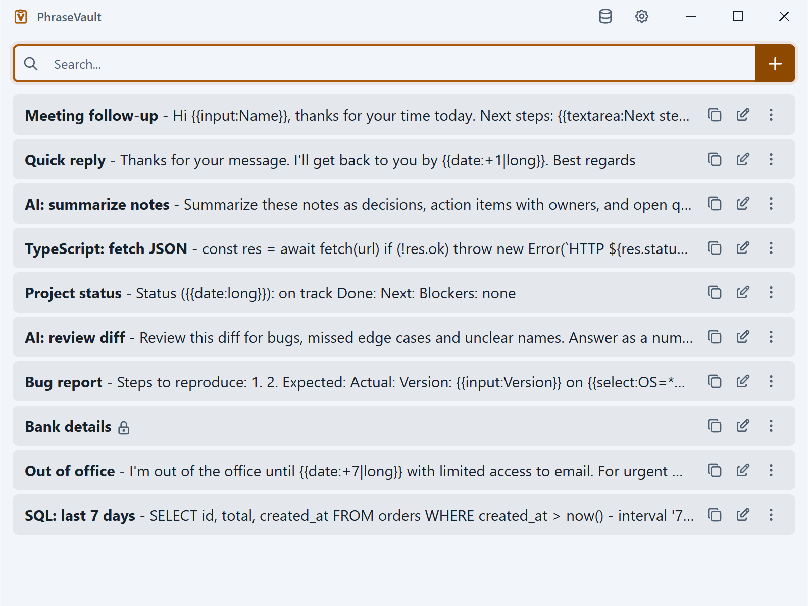

<p align="center">
  
</p>

<h1 align="center">PhraseVault</h1>

<p align="center">
  <strong>Save text once, insert anywhere.</strong><br>
  A local text expander and snippet manager for Windows and macOS.
</p>

<p align="center">
  <a href="LICENSE.md"></a>
  <a href="https://phrasevault.app/download"></a>
  
  
  
  <a href="https://github.com/ptmrio/phrasevault/issues"></a>
</p>

<p align="center">
  <a href="https://phrasevault.app">Website</a> ·
  <a href="https://phrasevault.app/download">Download</a> ·
  <a href="LICENSE.md">License</a>
</p>

PhraseVault is for people who type the same things all day: support replies, email templates, code snippets, and AI prompts. Open it with a global shortcut, fuzzy-search a phrase, press Enter, and it pastes into whatever app you were already in. Data stays on your machine. There is no account, no telemetry, and no cloud.

This repository is the **source-available** tree for PhraseVault 3.0. It is **not** OSI open source. Signed installers: [phrasevault.app/download](https://phrasevault.app/download).



## License

[SPQRK Software License v1.1](LICENSE.md) covers everything in this repository. You may inspect the code and, with a licensed seat, modify it for your own internal use. You may **not** redistribute PhraseVault (source or binaries, original or modified) without written permission. Third-party libraries keep their own licenses; see `apps/phrasevault/THIRD_PARTY_NOTICES.md`.

Building from this tree does **not** grant a free commercial license. The app still uses a 14-day trial, then a purchased license key (`PV-…`). Keys are verified on-device; there is no online activation.

| You may | You may not |
|---------|-------------|
| Run the 14-day trial | Use it commercially after the trial without a seat |
| Buy a lifetime per-seat license | Redistribute, sell, or publish this source or your builds |
| Install on every device **you** use | Share one seat across people |
| Read and (as a licensed seat) privately modify the source | Strip notices, bypass license checks, or ship a competing product from this code |

## Build

### Requirements

- Windows 10/11 x64 or macOS 13+ (arm64)
- [Node.js](https://nodejs.org/) **22.12 or newer**
- [pnpm](https://pnpm.io/) **10** (pinned `pnpm@10.28.2`)
- Native build tools for `sqlite3`, `@hurdlegroup/robotjs`, and `node-window-manager` (Visual Studio Build Tools on Windows; Xcode CLI tools on macOS)
- Optional, for installers: [.NET SDK](https://dotnet.microsoft.com/download/dotnet) and [Velopack `vpk`](https://docs.velopack.io/) (`dotnet tool install -g vpk`)

On Windows, run install / start / make from **PowerShell**. WSL can edit files but native Electron rebuilds fail there.

```powershell
git clone https://github.com/ptmrio/phrasevault.git
cd phrasevault
pnpm install
```

| Command | What it does |
|---------|----------------|
| `pnpm dev` | CSS + renderer + Electron Forge start |
| `pnpm typecheck` | `tsc --noEmit` |
| `pnpm test` | Vitest |
| `pnpm test:e2e` | Playwright against a local build (optional) |
| `pnpm make` | **Unsigned** package + Velopack installer (`--yes --nosign`) |

`pnpm make` will not Azure-sign or Apple-notarize. Do not point it at publisher credentials. Output: `apps/phrasevault/out/` (packaged app) and `apps/phrasevault/Releases/` (installer). Quit any installed PhraseVault first — two instances look like a native crash.

Issues: [github.com/ptmrio/phrasevault/issues](https://github.com/ptmrio/phrasevault/issues).
